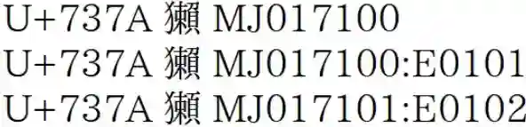

| 屬性名稱                   | 說明                                                               |
|------------------------|------------------------------------------------------------------|
| kAlternateTotalStrokes | 漢字的「備選總筆劃數」                                                      |
| kCangjie               | 漢字在`倉頡`輸入法中的編碼                                                   |
| kCheungBauer           | 此屬性顯示漢字在張日昇《香港粵語大詞典》(Cheung-Bauer, A Cantonese Dictionary)中的用法記錄 |
| kFenn                  | 漢字在芬恩《漢英字典》(The Five Thousand Dictionary)中的索引                    |
| kFourCornerCode        | 漢字的四角碼(一種基於漢字的幾何形狀和筆劃設計的檢索系統)                                    |
| kGradeLevel            | 漢字所屬的學級範圍(如日本教育所規定的用字等級)                                         |
| kHDZRadBreak           | 漢字在《漢語大字典》中的部首切分方式(即該字如何對應其部首)                                   |
| kHKGlyph               | 香港特有的字形資料                                                        |
| kMojiJoho              | 日本《文字情報》中的相關漢字資訊                                                 |
| kPhonetic              | 漢字的常見音讀或音註                                                       |
| kStrange               | 特殊或罕見的筆劃數(可能因變體字或特定字形設計影響)                                       |
| kUnihanCore2020        | 2020 年度的 UniHan 核心數據記錄，統計常用漢字的相關資料                               |

## kAlternateTotalStrokes

此屬性表示漢字的筆畫總數（包括部首）

它與 kTotalStrokes 屬性相似，但 kAlternateTotalStrokes 提供了不同 IRG 來源的替代筆畫數，並且可能包含一個來源標識符

**如果只有一個 kTotalStrokes 值，則 kAlternateTotalStrokes 的值通常為“-”**，表示所有 IRG 來源都使用相同的筆畫數。

例如，`U+4E95 井` 的 kAlternateTotalStrokes 值為“-”

## kCangjie

`倉頡`輸入法中的編碼

## kCheungBauer

此屬性提供關於漢字在《粵語漢字的表達》中的數據，這是一本關於粵語的學術著作

每個數據值包含三個部分

1. 以分號分隔
2. 部首筆畫索引
3. 倉頡輸入碼（如果有的話)

一個以逗號分隔的粵語讀音列表，使用粵拼羅馬化

## kFenn

此屬性提供漢字在《The Five Thousand Dictionary》中的數據

數據由一個十進制數字和一個字母 A 到 K，字母 P 或一個*星號組成

- 數字: 表示漢字的音標
- 字母:表示大致的頻率
- `P`:表示該字只因其是其他字的音標元素而被收錄
- `*`星號: 表示該字屬於某個音標組，但未被收錄在字典中

## kFourCornerCode

屬性提供漢字的: [四角碼](https://zh.wikipedia.org/zh-tw/%E5%9B%9B%E8%A7%92%E5%8F%B7%E7%A0%81)

四角碼是一種漢字檢索方法，使用**四個數字**來表示漢字的四個角

一個可選的第五位數字可以進一步區分漢字

## kGradeLevel

此屬性表示香港學校系統中學生應學習漢字的年級

例如，如果一個漢字的 kGradeLevel 值為 `1`，表示學生應在`小學一年級`學習該漢字

## kHDZRadBreak

## kHKGlyph

## kMojiJoho

此屬性提供漢字與文字情報基盤資料庫（Moji Jōhō Kiban database）的序號的映射

它用於標準化變體序列 (SVS) 和表意文字變體序列 (IVS)，這些序列使用漢字作為基礎字符

```yaml
U+3404	kMojiJoho	MJ068055 MJ000008:E0100 MJ000007:E0101 MJ068055:E0102
MJ068055：沒有變體選擇器的基本 MJ 碼
MJ000008:E0100：帶有變體選擇器 E0100 的 MJ 碼
MJ000007:E0101：帶有變體選擇器 E0101 的 MJ 碼
```



## kPhonetic

此屬性提供漢字的音標分類，數據來自《Ten Thousand Characters: An Analytic Dictionary》

同一音標類的漢字具有共同的音標元素

某些類別有多個子類別，用 A 到 D 表示

有些漢字被分配到多個類別

## kStrange

屬性標識在某些方面被認為是“奇怪”的CJK 統一漢字

此屬性使用多個類別來標記漢字的奇怪之處，例如:

- 不對稱
- 類似注音符號
- 草書
- 完全反射
- 包含韓文組件
- 不完整
- 包含片假名組件
- 镜像
- 包含奇異組件
- 旋转
- 筆畫過多
- 結構不尋常
- ...

## kUnihanCore2020

此屬性表示漢字是否屬於 Unihan Core 2020 集合，它是**東亞地區所需的最少漢字集**！

如果一個漢字有 kUnihanCore2020 屬性值，則該字屬於該集合
