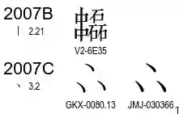

charts的資料可以參考

- https://www.unicode.org/Public/UCD/latest/charts/CodeCharts.pdf
- https://www.unicode.org/charts/#scripts

PDF之中會記錄以下內容

其中的GKX, JMJ, V2等意思，為[IRGSource](../Unihan/Unihan_IRGSources.txt)的來源，可以在此連結找到解釋

> https://www.unicode.org/reports/tr38/#N10106

| 來源            | 相關代號                                   | 描述                    |
|---------------|----------------------------------------|-----------------------|
| kIRG_GSource  | G1, G3, G4K, G5, G7, G8, GHZ, GKX, GHZ | 中國和新加坡                |
| kIRG_HSource  | H, HB1, HB2                            | 香港特別行政區               |
| kIRG_JSource  | J0, J1, J3A, J4, JMJ, J13, J14         | 日本                    |
| kIRG_KPSource | KP1                                    | 北韓                    |
| kIRG_KSource  | K4                                     | 韓國                    |
| kIRG_MSource  | MD                                     | 澳門特別行政區               |
| kIRG_SSource  | SAT                                    | SAT Daizōkyō 文字資料庫委員會 |
| kIRG_TSource  | T6                                     | TCA                   |
| kIRG_UKSource | UK                                     | 英國                    |
| kIRG_USource  | UTC                                    | UTC                   |
| kIRG_VSource  | VN                                     | 越南                    |

## FAQ

### [能不能從PDF取字或者圖拿來用](https://www.unicode.org/faq/font_keyboard.html)

不行。

這些字是由一些場廠商提供，未經授權不能破解來用

> https://www.unicode.org/charts/fonts.html 此連結可以找到相關的貢獻商
